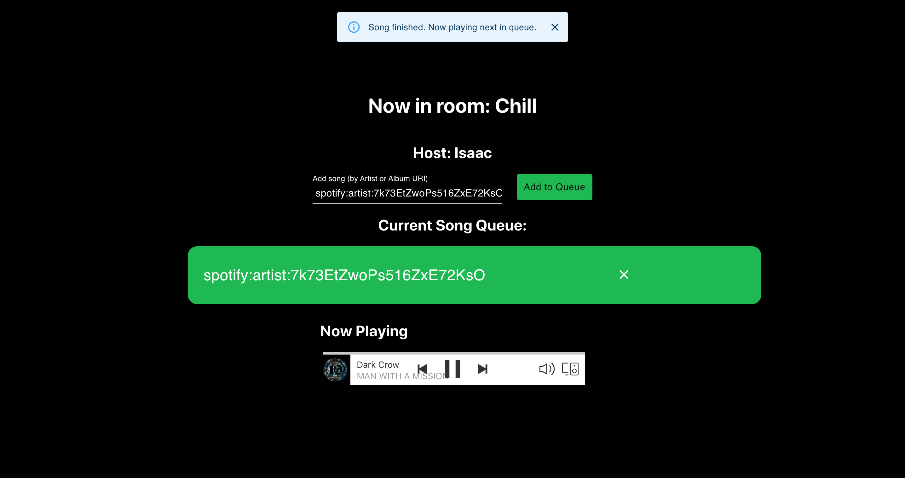

# Linkify

Listen to music together virtually. Made for HackOurCampus at Cornell.

## Instructions

Run `npm start` to concurrently start the Express server and React front-end.

### Limitations

There are some limitations when running the project.

First and foremost, Spotify requires you to have a Premium account to use the Web Playback API (or at least to have streaming priviledges with the API). That means you must sign up for a trial of Premium if you don't have it already in order to use this project.

There is also a problem with the playback, and only artists seem to work (not individual tracks). You can find the URIs of any artist you want from Spotify from clicking Share > Copy Spotify URI. 

Another thing to note is that Spotify Access Tokens expire relatively quickly, but in a future update this possibly can be prepared for ahead of time. The current solution is just to grab the access token on login and then write it into localStorage.

### Technical Challenges

1. Setting up the OAuth flow with Spotify and our tech stack (React + Typescript with an Express server to handle routing and server-side logic)
2. Getting the music player to play music